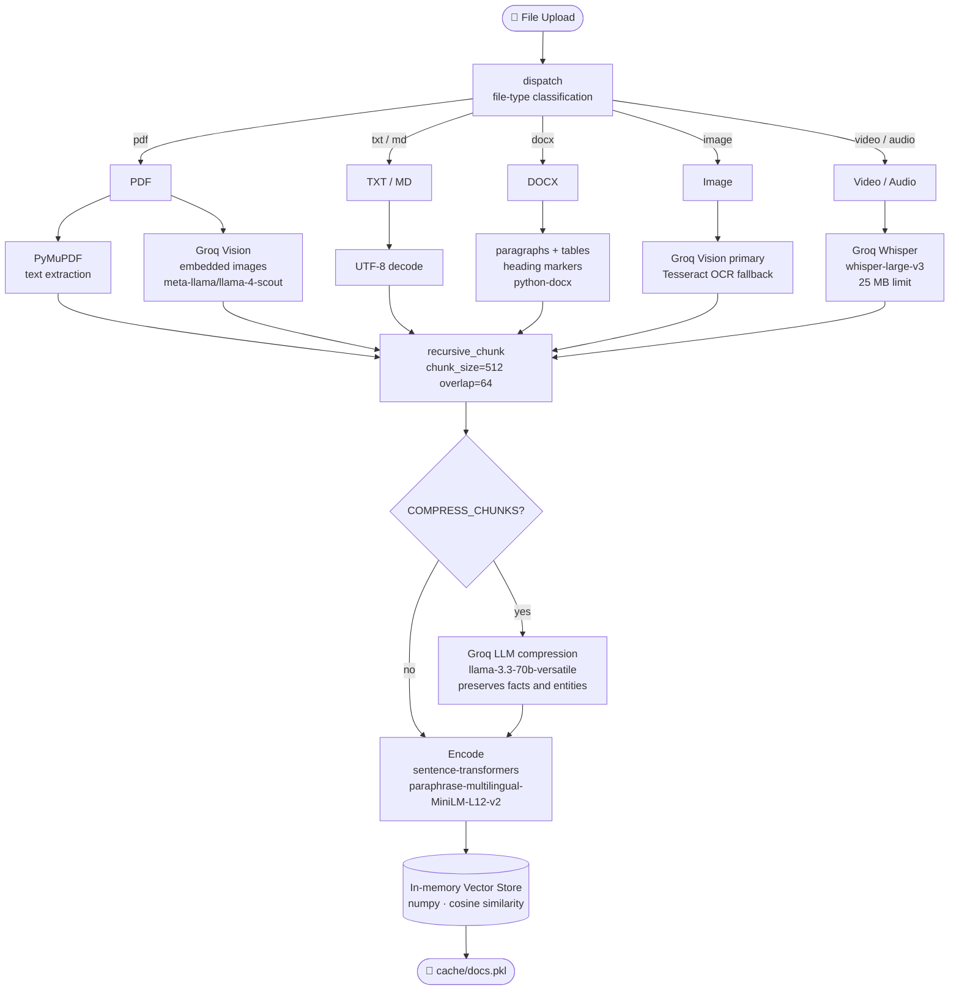
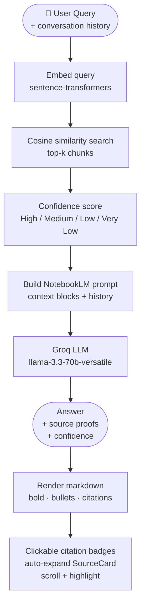

# AMANLM — AI Research Assistant

A local NotebookLM-like platform. Upload your documents, videos, and audio files and chat with them — every answer is grounded in your sources with verbatim quotes, clickable citations, and a confidence score.

---

## Live Demo

The app is deployed and publicly accessible at:

**https://amanlm.vercel.app/**

> Available until **June 12, 2026** (29-day deployment window).
> Backend hosted on [Railway](https://railway.app) · Frontend hosted on [Vercel](https://vercel.com)

---

## Features

- **RAG-powered chat** — answers are grounded in your uploaded sources with a NotebookLM-inspired prompt strategy
- **Conversation history** — the assistant remembers prior turns in the session for coherent multi-turn Q&A
- **Clickable inline citations** — `[1]`, `[2, 3]` markers in the answer are interactive badges; clicking one auto-expands and highlights the matching source card
- **Source proof** — every answer shows the exact quote, filename, and page number it came from
- **Confidence score** — a 0–100 % bar shows how well the answer is grounded in your sources
- **Short / Long answer toggle** — switch between concise and detailed responses
- **Multi-format uploads** — PDF, TXT, DOCX, Markdown, images, video, and audio
- **Structured DOCX extraction** — paragraphs, headings, and tables (pipe-delimited rows, merged-cell deduplication)
- **Vision-powered PDF parsing** — embedded images inside PDFs are described by a vision LLM and indexed alongside the text
- **Video / audio transcription** — MP4, WebM, MP3, WAV and more are transcribed via Groq Whisper and indexed as searchable knowledge
- **LLM chunk compression** *(opt-in)* — parsed chunks can be compressed by the LLM before embedding to reduce prompt token usage
- **Persistent cache** — documents survive restarts via a local pickle cache
- **Dark mode** — on by default

---

## Architecture

### Ingestion Pipeline



### Query Pipeline



---

## Requirements

- Python 3.10+
- Node.js 18+
- A [Groq](https://console.groq.com) API key (free)
- *(Optional)* [Tesseract](https://github.com/UB-Mannheim/tesseract/wiki) for image OCR fallback
- *(Optional)* [moviepy](https://pypi.org/project/moviepy/) + system ffmpeg for non-native video formats (.mov, .avi, .mkv)

---

## Setup

### 1. Clone the repo

```bash
git clone https://github.com/guybensi/AMANLM.git
cd AMANLM
```

### 2. Configure environment

```bash
cp .env.example .env
```

Edit `.env` and add your Groq API key:

```
GROQ_API_KEY=your_groq_api_key_here
```

### 3. Install Python dependencies

```bash
# Install CPU-only PyTorch first (saves ~1.5 GB vs the full CUDA version)
pip install torch --index-url https://download.pytorch.org/whl/cpu

# Install the rest
pip install -r requirements.txt
```

### 4. Build the frontend

```bash
cd frontend
npm install
npm run build
cd ..
```

### 5. Run

```bash
python app.py
```

Open your browser at **http://localhost:8000**

---

## Usage

1. **Upload documents** — drag and drop files into the left sidebar (PDF, TXT, DOCX, images, video, audio)
2. **Ask questions** — type in the chat box and press Enter
3. **Read the answer** — each response includes a confidence bar and inline citation badges (`[1]`, `[2]`, …)
4. **Click a citation** — the matching source card expands and scrolls into view automatically
5. **Toggle answer length** — use the ⚡ Short / 📝 Long buttons above the input box

---

## Configuration

All settings are read from `.env`. Copy `.env.example` for the full reference.

| Variable | Default | Description |
|---|---|---|
| `GROQ_API_KEY` | *(required)* | Your Groq API key |
| `GROQ_MODEL` | `llama-3.3-70b-versatile` | Chat / RAG LLM |
| `GROQ_VISION_MODEL` | `meta-llama/llama-4-scout-17b-16e-instruct` | Vision model for images and PDF image extraction |
| `GROQ_AUDIO_MODEL` | `whisper-large-v3` | Whisper model for video / audio transcription |
| `COMPRESS_CHUNKS` | `false` | Enable LLM-based chunk compression at ingestion time |
| `COMPRESS_MIN_LENGTH` | `200` | Only compress chunks longer than this many characters |

### Available Groq Models

| Purpose | Model | Notes |
|---|---|---|
| **Chat / RAG** | `llama-3.3-70b-versatile` | Best quality — recommended |
| | `llama-3.1-8b-instant` | Fastest, lighter |
| | `mixtral-8x7b-32768` | Long context |
| **Vision** | `meta-llama/llama-4-scout-17b-16e-instruct` | Fast — recommended |
| | `meta-llama/llama-4-maverick-17b-128e-instruct` | Higher quality, slower |
| **Audio / Video** | `whisper-large-v3` | Highest quality — recommended |
| | `whisper-large-v3-turbo` | Faster, slightly lower quality |

---

## Supported File Types

| Format | Extensions | Processing |
|---|---|---|
| PDF | `.pdf` | Text extraction (PyMuPDF) + embedded images (Groq Vision) |
| Plain text | `.txt`, `.md` | UTF-8 decode |
| Word | `.docx` | Paragraphs, headings, tables (python-docx) |
| Image | `.jpg`, `.jpeg`, `.png`, `.webp` | Groq Vision → Tesseract OCR fallback |
| Video | `.mp4`, `.webm`, `.mov`, `.avi`, `.mkv`, `.m4v` | Groq Whisper transcription (25 MB limit) |
| Audio | `.mp3`, `.m4a`, `.wav`, `.ogg`, `.flac`, `.opus` | Groq Whisper transcription (25 MB limit) |

---

## Project Structure

```
AMANLM/
├── app.py                         # Entry point — run this to start the server
├── requirements.txt
├── .env                           # Your API key and settings (not committed)
├── .env.example                   # Reference for all available settings
├── backend/
│   ├── config.py                  # Settings loaded from .env
│   ├── main.py                    # FastAPI app + CORS + static file serving
│   ├── routers/
│   │   ├── documents.py           # Upload / list / delete endpoints
│   │   └── chat.py                # RAG chat endpoint (history-aware)
│   ├── services/
│   │   ├── document_processor.py  # File-type dispatch + per-format parsers
│   │   ├── vision_service.py      # Groq Vision API (images + PDF pages)
│   │   ├── transcription_service.py # Groq Whisper API (video + audio)
│   │   ├── compression_service.py # Optional LLM chunk compression
│   │   ├── embedding_service.py   # sentence-transformers encoder
│   │   ├── vector_store.py        # In-memory numpy store + pickle cache
│   │   ├── rag_service.py         # Cosine retrieval + confidence scoring
│   │   └── llm_service.py         # Groq chat API + NotebookLM prompt builder
│   └── models/                    # Pydantic request / response schemas
│       ├── chat.py                # ChatRequest (with history), ChatResponse
│       └── document.py            # Chunk, DocumentMeta, UploadResponse
├── frontend/                      # React + Vite source
│   └── src/
│       ├── components/
│       │   ├── Chat/              # ChatWindow, MessageBubble, ConfidenceBar, InputBar
│       │   └── Sources/           # SourceCard (highlight + auto-expand)
│       ├── hooks/                 # useChat (history-aware), useDocuments
│       └── stores/                # Zustand global state
├── tests/                         # pytest unit tests (156 tests)
│   ├── test_document_processor.py
│   ├── test_transcription_service.py
│   ├── test_compression_service.py
│   ├── test_vision_service.py
│   ├── test_llm_service.py
│   ├── test_rag_service.py
│   ├── test_vector_store.py
│   └── test_text_utils.py
├── static/                        # Built frontend (served by FastAPI)
└── cache/                         # Auto-created — persists uploaded docs across restarts
```

---

## Notes

- The embedding model (`paraphrase-multilingual-MiniLM-L12-v2`, ~120 MB) downloads automatically on first run
- Image OCR fallback requires the Tesseract binary: [Windows installer](https://github.com/UB-Mannheim/tesseract/wiki)
- Video/audio files over **25 MB** are rejected by the Groq Whisper API and will produce zero chunks
- Non-native video formats (`.mov`, `.avi`, `.mkv`) require `moviepy` and system `ffmpeg` for audio extraction
- Documents are stored in memory and cached to `cache/docs.pkl` — delete this file to reset
- `COMPRESS_CHUNKS=true` makes uploads slower (one extra LLM call per chunk) but produces denser, more token-efficient chunks — useful for large, dense documents
